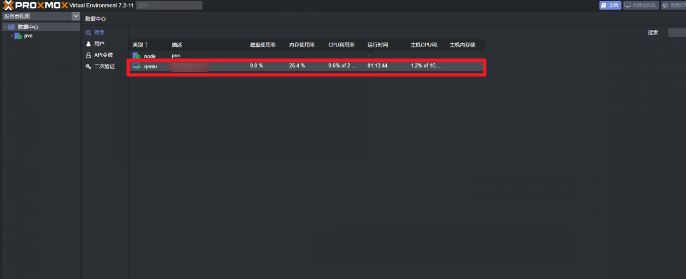

# 小竹VPS使用指南

首页：https://vps.bamboomc.cn

本指南手机端请访问：[https://vps.bamboomc.cn/help/phone.html](https://vps.bamboomc.cn/help/phone.html)

更多MC教程：https://bamboomc.cn/help-online

## 远程桌面

### 下载

#### 电脑端

按Windows键，搜索“远程桌面连接”或“rdp”即可看到

#### 手机端

请自行下载App，例如：http://www.2265.com/soft/287184.html（我不对以上链接负责，请自行寻找App）

### 使用

#### 电脑端

电脑端如上图，计算机后填写我给您的远程桌面地址（例如：pve.bamboomc.cn:1080）

用户名统一填写：Administrator

然后点击连接，会提示输入密码，输入我给您的密码即可

#### 手机端

.jpg)

打开App，点击右上角加号，选择Desktop

.jpg)

选择ADD MANUALLY

.jpg)

PC name里填写我给您的远程桌面地址（例如：pve.bamboomc.cn:1080）

User name下面点击右边的小三角，选择Add user account

.jpg)

第一行用户名统一填写：Administrator，第二行填我给您的密码，最后点SAVE就行了。

## 设置防火墙规则（我已帮您配置）

按Windows键，搜索“防火墙”，点击“Windows Defender 防火墙”

点击“高级设置”

在入站规则和出站规则中分别设置您的端口，我只使用入站规则举例，出站规则是一样的，点击“入站规则”后，在右面选择“新建规则”，接下来选择端口，下一步选择TCP（Java版）或者UDP（基岩版），在特定本地端口处输入我给您提供的端口范围（例如10010-10086），这里的横杠一定要是英文的(-)，下一步默认，继续下一步也是默认，再下一步名字自己随便起，最后点完成即可。

出站规则也是同样操作。

## PVE管理后台

什么是PVE？PVE就是类似于VMware的虚拟机平台，可以在PVE管理后台直接对您的VPS进行开关机操作，或者远程桌面。

### 登录

我们的PVE管理后台地址是：https://pve.bamboomc.cn:8000/

PS：一定要访问https

进入后用户名填写您给我提供的用户名（不是Administrator，Administrator是vps的登录用户名，而不是这个网页的用户名），密码填写您设置的密码，领域一定要选择“Proxmox VE authentication server”，最后点登录即可进入。

### 管理

首次登录是以下图片，双击您的vps即可看到运行状态

在“概要”面板可以看到您的vps的统计信息和实时状态，

“备注”中是您的vps的登录用户名和密码，还有开放的端口。

### TOTP二次验证登录

由于我们的PVE后台暴露在互联网当中，有不少恶意访问。为了后台账号的安全，您可以使用TOTP二次验证，以下是TOTP二次验证的教程。

TOTP二次验证类似于QQ安全中心的动态令牌。

首先在手机上安装APP：

安卓手机：https://bamboomc.lanzout.com/ic5L70e0r38d（密码:evvy）

苹果手机在AppStore自行搜索TOTP软件挑选，操作流程大致相同。

安装完成后自行根据引导设置一些内容

设置好后在PVE控制后台根据下图操作

找到二次验证，点击添加，选择第一项“TOTP”

然后在手机上点击加号，扫描屏幕上的二维码即可添加令牌，然后在验证码后面的空里，输入当前手机上显示的令牌，然后下面输入PVE后台用户密码，最后在第二行写描述（随便写也行，就相当于一个备注），最后点添加即可。之后登录时，输入密码点击登录后还需要验证TOTP令牌。
